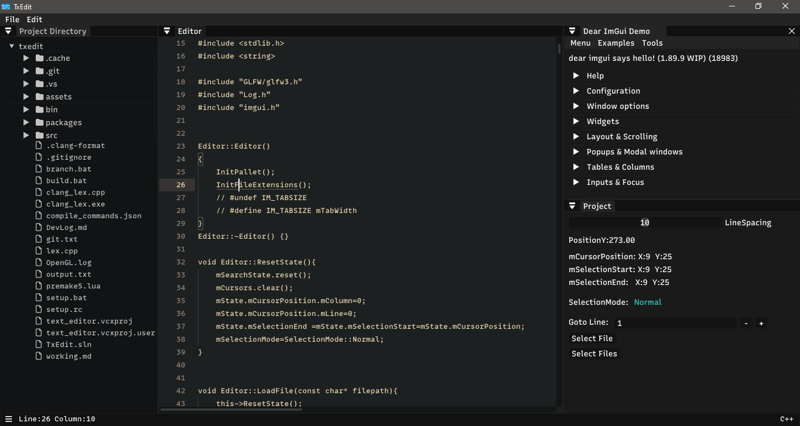
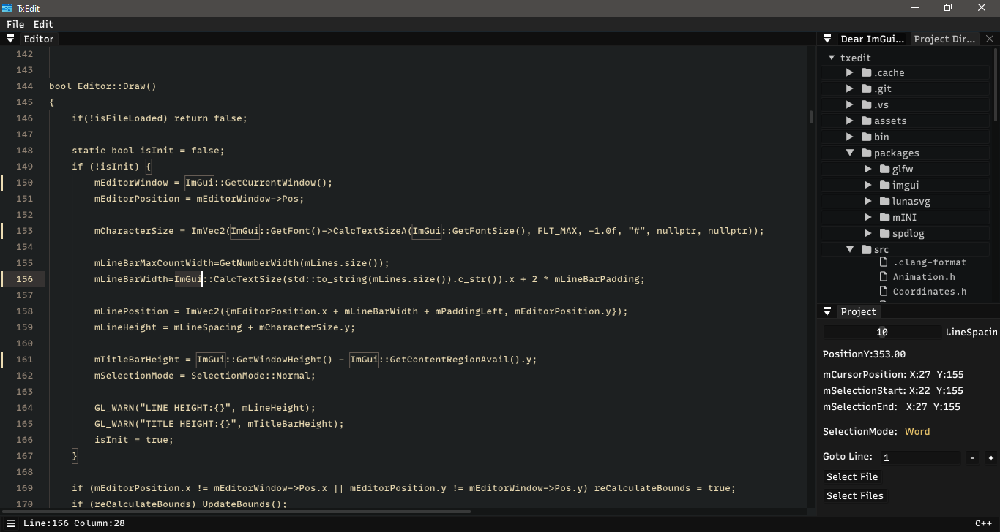
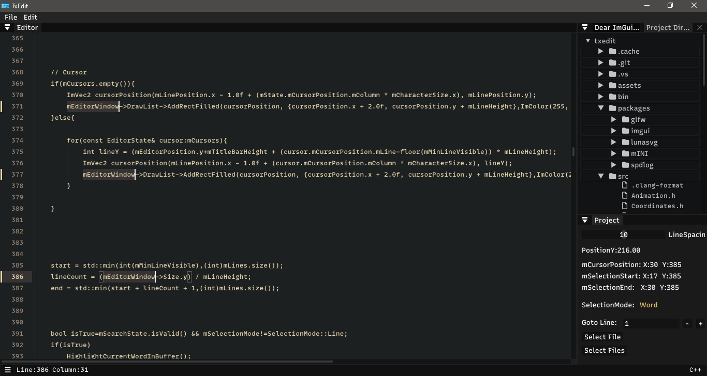

# TxEdit🍀
TxEdit is a minimalistic yet powerful text editor built using C/C++, designed to be close IDE coding experience TxEdit offers a user-friendly interface combined with essential features to enhance your productivity.
> [!NOTE]  
> Feel free to use it.

### Introducing "TxEdit" a light-weight text editor for Windows

SpectrumColor Pro is a powerful and user-friendly color picker designed to enhance your color selection experience on the Windows desktop. This feature-rich application empowers users to seamlessly:

> [!WARNING]  
> The application is still in development phase and still has bugs.

- **Advanced Key Bindings**: Key Bindings are inspired by sublime text. Use Ctrl+d to select multiple instance of current word
- **Minimal UI**: Provided a UI with a directory tree on left and the text editing pane on the right.
- **Copy-Paste Feature**: Allows you to copy and paste text from and to the text editor.

> [!CAUTION]
> Application will crash